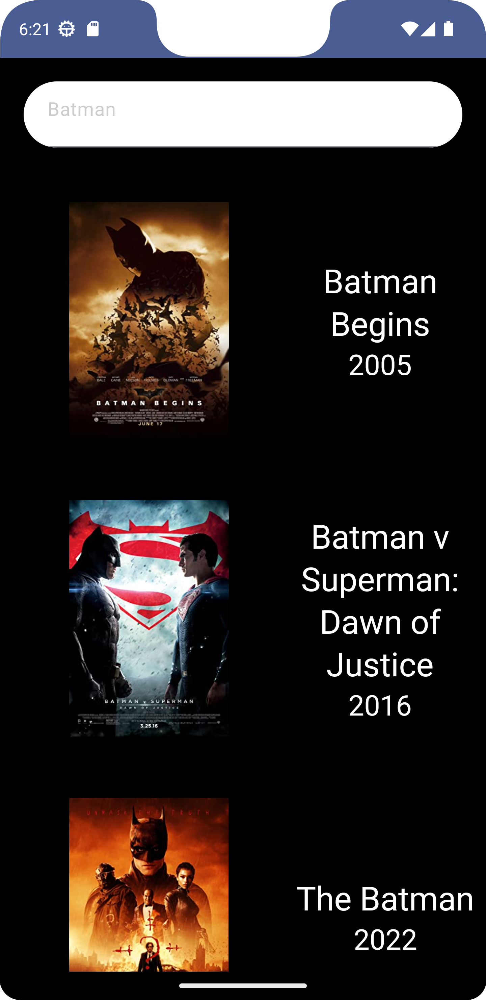
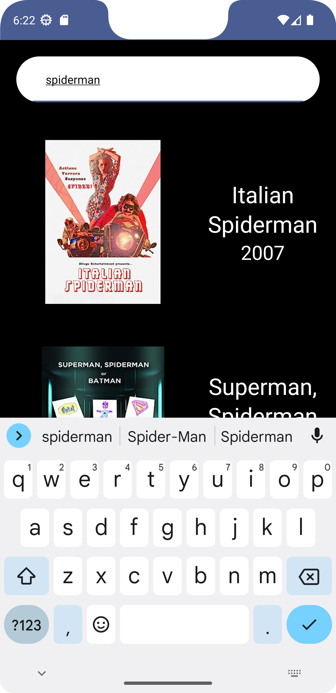

# MovieLand

MovieLand is an app where users can search for any film using the search bar, and when they click on a film, they can view all the relevant details on the related screen.

***API:***  https://www.omdbapi.com/

# Libraries Used

+ MVVM + Clean Architecture
+ [Hilt](https://developer.android.com/jetpack/compose/libraries#hilt)
+ [Navigation Component](https://developer.android.com/guide/navigation/navigation-getting-started)
+ [ViewModel](https://developer.android.com/topic/libraries/architecture/viewmodel#implement)
+ [Coroutines](https://developer.android.com/kotlin/coroutines)
+ [Flow](https://developer.android.com/kotlin/flow)
+ [Repositories](https://developer.android.com/topic/architecture#data-layer)
+ [State](https://developer.android.com/jetpack/compose/state)
+ [Jetpack Compose](https://developer.android.com/jetpack/compose/documentation)
+ ***Third party libraries***
  - [Retrofit](https://square.github.io/retrofit/)
  - [OkHttp](https://square.github.io/okhttp/recipes/)
  - [Gson](https://github.com/google/gson)

# Output
| Search Screen | On Search Screen | Detail Screen |
| --- | --- | --- |
|  |  |  | 
